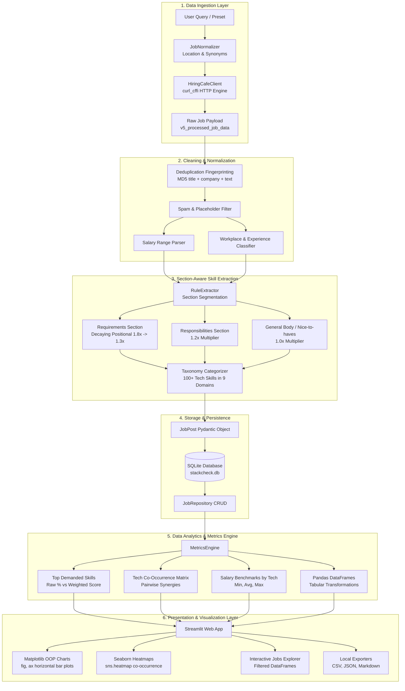

# StackCheck: System Architecture & Technical Specification

> System architecture, data pipeline, and technical specification for StackCheck.

---

## 1. 📂 Repository Structure

```
StackCheck/
├── app.py                      # 🚀 Top-level launcher: streamlit run app.py
├── build_app.py                # 📦 Standalone PyInstaller desktop binary compiler
├── pyproject.toml              # Dependencies & build configuration
├── README.md                   # Project documentation & usage guide
├── PRESENTATION.md             # Technical methodology & slide deck
├── ARCHITECTURE.md             # Complete system architecture specification
├── tests/                      # Automated Unit Test Suite (35 passing tests)
│   ├── test_analyzer.py        # Tests for segmentation, weighting & metrics
│   ├── test_client.py          # Tests for client parsing & location normalizer
│   ├── test_normalizer_relevance.py # Tests for strict role relevance filtering
│   ├── test_salary_chart_robustness.py # Tests for sample size thresholds & collision-free layout
│   ├── test_storage.py         # Tests for SQLite repository, projects & isolation
│   ├── test_web.py             # Tests for Pandas conversions & Matplotlib charts
│   ├── test_cli.py             # Tests for Rich CLI commands, flags & outputs
│   └── test_launcher.py        # Tests for instance tracking, script sync & env sanitization
└── src/stackcheck/
    ├── client/                 # 🌐 Real-World Data Ingestion Layer
    │   ├── hiringcafe.py       # Live scraper (curl_cffi, zero mock data)
    │   └── normalizer.py       # Country typo/synonym mapper & data cleaner
    ├── analyzer/               # 🧠 Section-Aware Data Analysis Engine
    │   ├── taxonomy.py         # 100+ technologies across 9 domain categories
    │   ├── rule_extractor.py   # Requirements (1.8x) vs Responsibilities (1.2x)
    │   ├── llm_extractor.py    # Optional Gemini / OpenAI enrichment
    │   ├── currency.py         # 💱 Currency normalizer, daily exchange rate sync & custom rates
    │   └── metrics.py          # Co-occurrence, salary stats & Pandas DataFrames
    ├── storage/                # 💾 Storage & Export Layer
    │   ├── db.py               # SQLite schema (projects, search runs, jobs, skills)
    │   ├── repository.py       # Project-scoped CRUD data access layer
    │   ├── sync.py             # Community benchmark aggregator
    │   └── exporters.py        # CSV, JSON, and Markdown report exporters
    ├── web/                    # 📊 Streamlit Web Dashboard Layer
    │   ├── app.py              # Interactive web analytics dashboard (project-aware)
    │   └── charts.py           # Matplotlib OOP API (fig, ax) & Seaborn heatmaps
    ├── models.py               # Pydantic data schemas
    ├── config.py               # Central workspace paths (~/.stackcheck/)
    ├── launcher.py             # Programmatic Streamlit bootloader & lifecycle engine
    ├── updater.py              # In-place auto-updater from GitHub Releases
    └── cli.py                  # Rich CLI interface with detached daemon support
```

---

## 2. 🔄 End-to-End Data Pipeline Architecture



---

## 3. 🧩 Core Architectural Subsystems

### 🌐 Layer 1: Data Ingestion & Normalization (`src/stackcheck/client/`)
- **`hiringcafe.py` (`HiringCafeClient`)**:
  - Connects to HiringCafe's public search API using `curl_cffi` (`impersonate="chrome124"`) to reliably navigate TLS handshakes and emulate standard browser behavior.
  - **⚡ 98% Request Reduction (Batch SSR Harvesting)**: Rather than launching heavy headless Chromium/Selenium browser instances or navigating to 2,000 separate job URLs one-by-one, StackCheck intercepts Next.js `__NEXT_DATA__` server-side rendered payloads. Each single lightweight HTTP request returns **60 to 90 complete structured job profiles at once**. Collecting 2,000 jobs requires only ~25–30 requests in total.
  - **⏱️ Human-Cadence Polite Pacing**: Sequential page requests are throttled with courtesy pauses (`time.sleep(0.35)`) over a single persistent HTTP connection. This keeps network activity identical to a human browsing search results, preventing any server strain or DDoS risk.
  - **🔒 Zero-Re-scrape Architecture (100% Local Compute)**: Ingested jobs are stored in local SQLite. All subsequent skill extraction, NLP disambiguation, salary recalculations, filtering, and chart rendering happen **entirely offline on the user's local machine**—sending zero recurring network traffic to HiringCafe.
  - **Zero Synthetic Data Policy**: Returns exclusively real job posts. If no internet or empty results occur, reports transparent status messages rather than fabricating fake data.
- **`normalizer.py` (`JobNormalizer`)**:
  - **Strict Role Relevance Filtering (`is_role_relevant`)**: Tokenized role-class and term validator preventing unrelated roles (e.g. SRE, C++ low-latency infrastructure) from polluting niche search queries like Data Analyst.
  - **Location Synonym & Typo Mapping**: Maps abbreviations and common typos (`"PK"`, `"Lahore"`, `"Indai"`, `"Bangalore"`, `"NZ"`, `"Brasil"`, `"Amercia"`, `"UK"`, `"Tokyo"`, etc.) to canonical country names.
  - **Deterministic MD5 Fingerprinting**: Calculates `MD5(normalized_title | normalized_company | first_200_desc_chars)` to deduplicate postings across multiple scrape runs.
  - **Spam Filtering**: Drops scam listings, commission-only schemes, and descriptions shorter than 30 characters.
  - **Salary Extraction**: Parses structured compensation ranges or regex-extracts USD yearly/hourly compensation.

---

### 🧠 Layer 2: Analysis & Metrics Engine (`src/stackcheck/analyzer/`)
- **`taxonomy.py`**:
  - Contains 100+ normalized technologies grouped into 9 standardized categories:
    1. *Programming Languages* (Python, SQL, R, Java, TypeScript, Go, etc.)
    2. *BI & Visualization* (Power BI, Tableau, Looker, Metabase, etc.)
    3. *Data Engineering & Platforms* (Spark, dbt, Airflow, Kafka, Databricks, Snowflake, etc.)
    4. *Databases & Storage* (PostgreSQL, MySQL, MongoDB, Redis, etc.)
    5. *Cloud & DevOps* (AWS, GCP, Azure, Docker, Kubernetes, Terraform, etc.)
    6. *AI / ML & Advanced Analytics* (PyTorch, TensorFlow, Scikit-learn, LangChain, LLMs, etc.)
    7. *Frameworks & Libraries* (FastAPI, React, Next.js, Django, etc.)
    8. *Concepts & Methodologies* (Data Modeling, ETL/ELT, A/B Testing, Statistics, Agile, etc.)
    9. *Other Tools & Tech*
- **`rule_extractor.py` (`RuleExtractor`)**:
  - Analyzes the job description structure. Prioritizes the **"What we are looking for"** section over general company marketing.
  - **Positional Weight Multipliers**:
    $$\text{Bullet 1} = 1.8\times \quad\mid\quad \text{Bullet 2} = 1.5\times \quad\mid\quad \text{Bullet 3} = 1.3\times \quad\mid\quad \text{Responsibilities} = 1.2\times \quad\mid\quad \text{Body} = 1.0\times$$
- **`llm_extractor.py` (`LLMExtractor`)**:
  - Optional zero-shot extractor supporting Google Gemini (`gemini-1.5-flash`) and OpenAI (`gpt-4o-mini`).
- **`metrics.py` (`MetricsEngine`)**:
  - Aggregates multi-dimensional stats:
    - Overall skill frequency and weighted demand score.
    - Symmetrical pairwise co-occurrence matrix for tech combinations.
    - Salary percentiles (Min, Average, Max) segmented by technology.
    - Regional partitions (**USA**, **Europe**, **Pakistan**, **India**, **APAC**, **Latin America**, **Middle East**, **Global Remote**).
    - Converts structured models to **Pandas DataFrames** (`to_jobs_dataframe()`, `to_skills_dataframe()`).
- **`currency.py` (`CurrencyManager`)**:
  - **Live Exchange Rate Engine**: Fetches daily floating exchange rates against USD via the open Frankfurter/Open-Exchange API ecosystem with a 24-hour TTL cache.
  - **Embedded Baseline Fallbacks**: Bundles rock-solid offline fallback rates for all major global and regional recruitment currencies (`INR`, `PKR`, `PHP`, `EUR`, `GBP`, `CAD`, `AUD`, `CRC`, `SGD`, etc.) to guarantee 100% offline availability.
  - **Dual-Path Cache Persistence**: Caches daily rates in `~/.stackcheck/exchange_rates.json` with automatic fallback to `./.stackcheck/exchange_rates.json` if user directory permissions are restricted.
  - **Smart Local Currency Inference**: Automatically detects when foreign market postings (e.g. Philippines ₱, Costa Rica ₡, India ₹) have salaries inadvertently mislabeled with "$" and dynamically converts them to canonical USD annual benchmarks.
  - **Sanity Bounds & Statistical Filtering**: Enforces annual salary boundaries ($5,000 to $750,000 USD) to prevent multi-million outlier spikes from distorting analytics.

---

### 💾 Layer 3: Persistence & Exporters (`src/stackcheck/storage/`)
- **`db.py` (`DatabaseManager`)**:
  - Embedded SQLite database located centrally at `~/.stackcheck/stackcheck.db`.
  - Deterministic connection lifecycle using `@contextmanager` to prevent file locking and connection leaks.
  - Multi-project isolation support via foreign keys (`project_id`) across `search_runs` and `jobs`.
- **`repository.py` (`JobRepository`)**:
  - Data Access Object (DAO) providing atomic save, query, project CRUD, search run logging, and cached job retrieval.
- **`sync.py` (`CommunitySyncClient`)**:
  - Local aggregation engine tracking real data distributions.
- **`exporters.py` (`ReportExporter`)**:
  - One-click exporter producing:
    - `JSON` full schema dump (`exports/stackcheck_run_*.json`).
    - `CSV` flat dataset with extracted skill strings (`exports/stackcheck_jobs_*.csv`).
    - `Markdown` executive brief (`exports/stackcheck_report_*.md`).

---

### 📊 Layer 4: Interactive Web Dashboard & Charts (`src/stackcheck/web/`)
- **`charts.py`**:
  - Built strictly using **Matplotlib's Object-Oriented API (`fig, ax = plt.subplots(...)`)** and **Seaborn**:
    - **`plot_top_skills()`**: Horizontal bar chart with direct percentage text labels, dynamic limits, and clean spine removal (`sns.despine`).
    - **`plot_co_occurrence_heatmap()`**: Correlation matrix heatmap (`sns.heatmap`) with annotated frequencies and color gradients.
    - **`plot_salary_by_tech()`**: Grouped salary error-bar chart displaying Min, Avg, and Max compensation with sample-size protection (`min_samples >= 3` with graceful fallback for sparse sets), sample count annotations on Y-axis labels (`n=X`), collision-free text positioning, and dual sorting modes (Highest Average Salary vs. Sample Count / In-Demand).
    - **`plot_distributions()`**: Donut charts for workplace mode and bar plots for experience level.
    - **`plot_category_breakdown()`**: Domain comparison bar chart.
- **`app.py`**:
  - 4-tab Streamlit dashboard:
    1. **📊 Executive Market Dashboard**: KPI metric cards, top skills chart with weighted score toggle, category breakdown, and project switcher.
    2. **📈 Deep Statistical Analytics**: Co-occurrence heatmap, interactive salary error-bars with sample thresholding & sorting toggles, workplace & experience distributions, regional partition table.
    3. **💼 Interactive Job Explorer**: Interactive Pandas DataFrame with text filter, skill dropdown, and expandable section breakdown cards.
    4. **🚀 Future Roadmap & Data Export**: Clean upcoming roadmap notice and 1-click download buttons for JSON, CSV, and Markdown.

---

### 🚀 Layer 5: Desktop Launcher & Workspace Engine (`src/stackcheck/launcher.py`, `cli.py`, `updater.py`)
- **`launcher.py`**:
  - Programmatically boots the local Streamlit engine without requiring a system `streamlit` CLI installation.
  - **Single-Instance Enforcement**: Reads and verifies PID from `~/.stackcheck/stackcheck.pid` and port availability; if an instance is already active, focuses the existing browser tab instead of spawning redundant server processes.
  - **Readiness Health Check**: Polls TCP connection availability (`is_port_listening`) before launching the system browser, preventing initial "connection refused" white-screens.
  - **Detached Daemon Mode (`-d`)**: Spawns detached background processes with sanitized child environments (stripping PyInstaller `_MEIPASS2` to preserve independent lifecycle).
  - **Deterministic Web App Sync**: Automatically extracts and synchronizes `app.py`, `charts.py`, and assets to `~/.stackcheck/web/` so Streamlit entrypoint files are immune to `/tmp` cleanup when parent CLI processes exit.
  - **Persistent Streamlit Frontend Mirroring**: Mirrors Streamlit static assets (`index.html`, JS/CSS bundles) to `~/.stackcheck/streamlit_static/` and monkeypatches `streamlit.file_util.get_static_dir()`, insulating the Starlette static route handler from PyInstaller temporary `_MEI...` cleanup and preventing `500 Internal Server Error` in detached or cold-boot instances.
  - **Cross-Platform UTF-8 Console Safety**: Auto-reconfigures standard output and error streams on Windows consoles to protect against legacy codepage `UnicodeEncodeError` when rendering Rich checkmarks, panels, and emojis.
- **`cli.py`**:
  - Production-grade Click CLI styled with Rich panels, spinners, and tables.
  - Commands: `stackcheck` (web dashboard), `stackcheck check` (deep runtime dependency & C-extension diagnostic), `stackcheck status`, `stackcheck stop`, `stackcheck update`, `stackcheck search`, `stackcheck analyze`, `stackcheck export`, `stackcheck projects`, and `stackcheck sync`.
- **`updater.py`**:
  - In-place auto-updater connecting to GitHub Releases API.
  - Detects current platform/architecture binary, streams downloads with rich progress bars, and replaces the running binary with executable permissions.

---

## 4. 🗄️ SQLite Database Schema & Workspace Storage

### Central Workspace Layout (`~/.stackcheck/`)
All execution methods (`uv run stackcheck`, local standalone `./dist/StackCheck`, and downloaded release binary) unify around the user data workspace:
- `~/.stackcheck/stackcheck.db`: Central SQLite database with multi-project isolation.
- `~/.stackcheck/stackcheck.pid`: Active server process PID.
- `~/.stackcheck/stackcheck.json`: Live port, URL, and start timestamp metadata.
- `~/.stackcheck/stackcheck.log`: Detached background daemon logs.
- `~/.stackcheck/streamlit_static/`: Persistent Streamlit frontend assets cache.
- `~/.stackcheck/web/`: Synchronized Streamlit application runtime (`app.py`, `charts.py`).
- `~/.stackcheck/assets/`: Embedded brand icons and logos.
- `~/.stackcheck/exports/`: Exported JSON, CSV, and Markdown briefs.

### Relational Schema Diagram
```
┌─────────────────────────────────┐
│            projects             │
├─────────────────────────────────┤
│ id           TEXT PRIMARY KEY   │
│ name         TEXT NOT NULL      │
│ description  TEXT               │
│ created_at   DATETIME           │
└─────────────────────────────────┘
          │ 1               │ 1
          │                 │
          │ *               │ *
┌─────────────────────────────────┐       ┌─────────────────────────────────┐
│          search_runs            │       │              jobs               │
├─────────────────────────────────┼───────┼─────────────────────────────────┤
│ id           INTEGER PK AUTOINC │ 1   * │ id           TEXT PRIMARY KEY   │
│ project_id   TEXT FK            │───────│ project_id   TEXT FK            │
│ query_str    TEXT NOT NULL      │       │ search_run_id INTEGER FK        │
│ location     TEXT               │       │ title        TEXT NOT NULL      │
│ workplace    TEXT               │       │ company      TEXT NOT NULL      │
│ experience   TEXT               │       │ location     TEXT               │
│ total_jobs   INTEGER            │       │ country      TEXT               │
│ created_at   DATETIME           │       │ region       TEXT               │
└─────────────────────────────────┘       │ workplace    TEXT               │
                                          │ experience   TEXT               │
                                          │ salary_min   REAL               │
                                          │ salary_max   REAL               │
                                          │ salary_curr  TEXT               │
                                          │ salary_period TEXT              │
                                          │ apply_url    TEXT               │
                                          │ scraped_at   DATETIME           │
                                          └─────────────────────────────────┘
                                                           │ 1
                                                           │
                                                           │ *
                                          ┌─────────────────────────────────┐
                                          │        extracted_skills         │
                                          ├─────────────────────────────────┤
                                          │ id           INTEGER PK AUTOINC │
                                          │ job_id       TEXT NOT NULL FK   │
                                          │ name         TEXT NOT NULL      │
                                          │ canonical    TEXT NOT NULL      │
                                          │ category     TEXT NOT NULL      │
                                          │ source_sec   TEXT               │
                                          │ priority_wt  REAL               │
                                          └─────────────────────────────────┘
```

---

## 5. 🎯 Data Analyst Skills Demonstrated

| Competency | Implementation Details |
| :--- | :--- |
| **Matplotlib OOP (`fig, ax`)** | Explicit figure/axes creation, custom axis limits, direct text bar labels (`ax.text`), tick formatters (`FuncFormatter`, `PercentFormatter`), and figure aesthetics. |
| **Seaborn Statistical Visualizations** | Symmetrical co-occurrence correlation matrix heatmaps (`sns.heatmap`), customized color palettes (`mako`, `crest`, `Blues`), and `sns.despine` styling. |
| **Pandas Data Pipelines** | Tabular DataFrame conversions, multi-condition vector filtering, co-occurrence frequency counts, group aggregations, and CSV serialization. |
| **Data Cleaning & Normalization** | Fuzzy string matching, synonym mapping for global tech hubs, regex compensation parsing, and MD5 duplicate elimination. |

---

## 6. 🧪 Test Suite & Verification

The automated test suite contains **32 tests** across 6 modules validating data ingestion, parsing, weighting, SQLite operations, multi-project isolation, DataFrame conversions, Matplotlib figure rendering, CLI commands, and launcher lifecycle management:

```bash
# Run the complete test suite
uv run pytest tests/ -v
```

```text
tests/test_analyzer.py::test_segment_job_description PASSED
tests/test_analyzer.py::test_rule_extractor_positional_weighting PASSED
tests/test_analyzer.py::test_job_normalizer PASSED
tests/test_analyzer.py::test_metrics_engine_aggregation PASSED
tests/test_analyzer.py::test_job_market_extended_metrics PASSED
tests/test_analyzer.py::test_currency_manager_conversions PASSED
tests/test_cli.py::test_cli_help PASSED
tests/test_cli.py::test_cli_version PASSED
tests/test_cli.py::test_cli_web_detach_flag PASSED
tests/test_cli.py::test_cli_status PASSED
tests/test_cli.py::test_cli_stop PASSED
tests/test_cli.py::test_cli_projects_list PASSED
tests/test_cli.py::test_launcher_config_sets_production_mode PASSED
tests/test_client.py::test_hiringcafe_client_structure PASSED
tests/test_client.py::test_hiringcafe_job_parsing PASSED
tests/test_client.py::test_location_normalization PASSED
tests/test_launcher.py::test_find_free_port PASSED
tests/test_launcher.py::test_updater_check_offline_or_invalid PASSED
tests/test_launcher.py::test_is_port_listening_unused_port PASSED
tests/test_launcher.py::test_instance_tracking_and_cleanup PASSED
tests/test_launcher.py::test_locate_target_script_and_persistent_sync PASSED
tests/test_launcher.py::test_detached_env_sanitization PASSED
tests/test_storage.py::test_repository_save_and_retrieve PASSED
tests/test_storage.py::test_exporters PASSED
tests/test_storage.py::test_project_isolation_and_crud PASSED
tests/test_storage.py::test_duplicate_detection_and_apply_urls PASSED
tests/test_storage.py::test_default_data_dir_isolation PASSED
tests/test_storage.py::test_project_query_memory_and_deduplication PASSED
tests/test_storage.py::test_get_all_jobs_beyond_500_limit PASSED
tests/test_web.py::test_dataframe_conversions PASSED
tests/test_web.py::test_charts_generation PASSED
tests/test_web.py::test_extended_job_market_charts PASSED

============================== 32 passed in 2.63s ==============================
```

---

## 7. 🚀 Execution & Distribution

StackCheck provides unified execution patterns that all share the centralized user workspace (`~/.stackcheck/`):

### 1. Development Mode (Source Scripts)
```bash
# Run the interactive Streamlit dashboard via uv
uv run stackcheck

# Run as background service
uv run stackcheck -d

# Direct Streamlit launcher
uv run streamlit run app.py
```

### 2. Standalone Desktop Binary (PyInstaller)
```bash
# Compile optimized standalone desktop executable (~158 MB slim bundle)
uv run python build_app.py --onefile

# Run compiled binary directly (zero Python dependencies required)
./dist/StackCheck

# Run detached background service
./dist/StackCheck -d

# Check service health & uptime
./dist/StackCheck status

# Run deep C-extension & runtime dependency verification
./dist/StackCheck check

# Terminate running server
./dist/StackCheck stop
```
