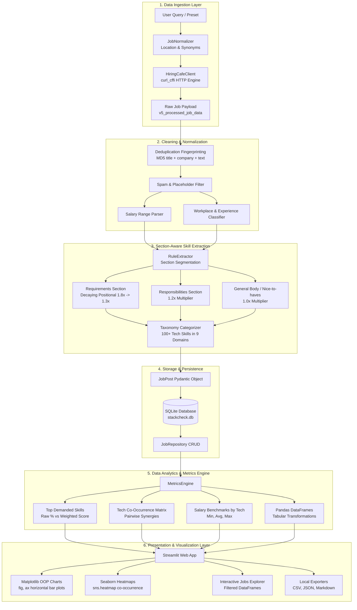

# 🏛️ StackCheck — System Architecture & Technical Specification

> **A Modular, High-Performance Tech Stack Market Intelligence Engine & Data Analytics Platform**

---

## 1. 📂 Repository Structure

```
StackCheck/
├── app.py                      # 🚀 Top-level launcher: streamlit run app.py
├── pyproject.toml              # Dependencies & build configuration
├── README.md                   # Project documentation & usage guide
├── PRESENTATION.md             # Technical methodology & slide deck
├── ARCHITECTURE.md             # Complete system architecture specification
├── tests/                      # Automated Unit Test Suite (11 passing tests)
│   ├── test_analyzer.py        # Tests for segmentation, weighting & metrics
│   ├── test_client.py          # Tests for client parsing & location normalizer
│   ├── test_storage.py         # Tests for SQLite repository & exporters
│   └── test_web.py             # Tests for Pandas conversions & Matplotlib charts
└── src/stackcheck/
    ├── client/                 # 🌐 Real-World Data Ingestion Layer
    │   ├── hiringcafe.py       # Live scraper (curl_cffi, zero mock data)
    │   └── normalizer.py       # Country typo/synonym mapper & data cleaner
    ├── analyzer/               # 🧠 Section-Aware Data Analysis Engine
    │   ├── taxonomy.py         # 100+ technologies across 9 domain categories
    │   ├── rule_extractor.py   # Requirements (1.8x) vs Responsibilities (1.2x)
    │   ├── llm_extractor.py    # Optional Gemini / OpenAI enrichment
    │   └── metrics.py          # Co-occurrence, salary stats & Pandas DataFrames
    ├── storage/                # 💾 Storage & Export Layer
    │   ├── db.py               # SQLite schema (search runs, jobs, skills)
    │   ├── repository.py       # CRUD data access layer
    │   ├── sync.py             # Community benchmark aggregator
    │   └── exporters.py        # CSV, JSON, and Markdown report exporters
    ├── web/                    # 📊 Streamlit Web Dashboard Layer
    │   ├── app.py              # 4-Tab interactive web analytics dashboard
    │   └── charts.py           # Matplotlib OOP API (fig, ax) & Seaborn heatmaps
    ├── models.py               # Pydantic data schemas
    ├── config.py               # Configuration & paths
    └── cli.py                  # CLI commands & web launcher
```

---

## 2. 🔄 End-to-End Data Pipeline Architecture



---

## 3. 🧩 Core Architectural Subsystems

### 🌐 Layer 1: Data Ingestion & Normalization (`src/stackcheck/client/`)
- **`hiringcafe.py` (`HiringCafeClient`)**:
  - Connects to HiringCafe's public search API using `curl_cffi` (`impersonate="chrome120"`) to reliably navigate TLS and anti-bot challenges.
  - **Zero Synthetic Data Policy**: Returns exclusively real job posts. If no internet or empty results occur, reports transparent status messages rather than fabricating fake data.
- **`normalizer.py` (`JobNormalizer`)**:
  - **Location Synonym & Typo Mapping**: Maps abbreviations and common typos (`"PK"`, `"Lahore"`, `"Indai"`, `"Bangalore"`, `"NZ"`, `"Brasil"`, `"Amercia"`, `"UK"`, `"Tokyo"`, etc.) to canonical country names.
  - **Deterministic MD5 Fingerprinting**: Calculates `MD5(normalized_title | normalized_company | first_200_desc_chars)` to deduplicate postings across multiple scrape runs.
  - **Spam Filtering**: Drops scam listings, commission-only schemes, and descriptions shorter than 30 characters.
  - **Salary Extraction**: Parses structured compensation ranges or regex-extracts USD yearly/hourly compensation.

---

### 🧠 Layer 2: Analysis & Metrics Engine (`src/stackcheck/analyzer/`)
- **`taxonomy.py`**:
  - Contains 100+ normalized technologies grouped into 9 standardized categories:
    1. *Programming Languages* (Python, SQL, R, Java, TypeScript, Go, etc.)
    2. *BI & Visualization* (Power BI, Tableau, Looker, Metabase, etc.)
    3. *Data Engineering & Platforms* (Spark, dbt, Airflow, Kafka, Databricks, Snowflake, etc.)
    4. *Databases & Storage* (PostgreSQL, MySQL, MongoDB, Redis, etc.)
    5. *Cloud & DevOps* (AWS, GCP, Azure, Docker, Kubernetes, Terraform, etc.)
    6. *AI / ML & Advanced Analytics* (PyTorch, TensorFlow, Scikit-learn, LangChain, LLMs, etc.)
    7. *Frameworks & Libraries* (FastAPI, React, Next.js, Django, etc.)
    8. *Concepts & Methodologies* (Data Modeling, ETL/ELT, A/B Testing, Statistics, Agile, etc.)
    9. *Other Tools & Tech*
- **`rule_extractor.py` (`RuleExtractor`)**:
  - Analyzes the job description structure. Prioritizes the **"What we are looking for"** section over general company marketing.
  - **Positional Weight Multipliers**:
    $$\text{Bullet 1} = 1.8\times \quad\mid\quad \text{Bullet 2} = 1.5\times \quad\mid\quad \text{Bullet 3} = 1.3\times \quad\mid\quad \text{Responsibilities} = 1.2\times \quad\mid\quad \text{Body} = 1.0\times$$
- **`llm_extractor.py` (`LLMExtractor`)**:
  - Optional zero-shot extractor supporting Google Gemini (`gemini-1.5-flash`) and OpenAI (`gpt-4o-mini`).
- **`metrics.py` (`MetricsEngine`)**:
  - Aggregates multi-dimensional stats:
    - Overall skill frequency and weighted demand score.
    - Symmetrical pairwise co-occurrence matrix for tech combinations.
    - Salary percentiles (Min, Average, Max) segmented by technology.
    - Regional partitions (**USA**, **Europe**, **Pakistan**, **India**, **APAC**, **Latin America**, **Middle East**, **Global Remote**).
    - Converts structured models to **Pandas DataFrames** (`to_jobs_dataframe()`, `to_skills_dataframe()`).

---

### 💾 Layer 3: Persistence & Exporters (`src/stackcheck/storage/`)
- **`db.py` (`Database`)**:
  - Embedded SQLite database (`stackcheck.db`) with relational tables: `search_runs`, `jobs`, and `extracted_skills`.
  - Indexed on `search_run_id`, `canonical_name`, `company`, `region`, and `workplace_type`.
- **`repository.py` (`JobRepository`)**:
  - Data Access Object (DAO) providing atomic save, query, search run logging, and cached job retrieval.
- **`sync.py` (`CommunitySyncClient`)**:
  - Local aggregation engine tracking real data distributions.
- **`exporters.py` (`ReportExporter`)**:
  - One-click exporter producing:
    - `JSON` full schema dump (`exports/stackcheck_run_*.json`).
    - `CSV` flat dataset with extracted skill strings (`exports/stackcheck_jobs_*.csv`).
    - `Markdown` executive brief (`exports/stackcheck_report_*.md`).

---

### 📊 Layer 4: Interactive Web Dashboard & Charts (`src/stackcheck/web/`)
- **`charts.py`**:
  - Built strictly using **Matplotlib's Object-Oriented API (`fig, ax = plt.subplots(...)`)** and **Seaborn**:
    - **`plot_top_skills()`**: Horizontal bar chart with direct percentage text labels, dynamic limits, and clean spine removal (`sns.despine`).
    - **`plot_co_occurrence_heatmap()`**: Correlation matrix heatmap (`sns.heatmap`) with annotated frequencies and color gradients.
    - **`plot_salary_by_tech()`**: Grouped salary error-bar chart showcasing Min, Avg, and Max compensation with currency tick formatting.
    - **`plot_distributions()`**: Donut charts for workplace mode and bar plots for experience level.
    - **`plot_category_breakdown()`**: Domain comparison bar chart.
- **`app.py`**:
  - 4-tab Streamlit dashboard:
    1. **📊 Executive Market Dashboard**: KPI metric cards, top skills chart with weighted score toggle, category breakdown.
    2. **📈 Deep Statistical Analytics**: Co-occurrence heatmap, salary error-bars, workplace & experience distributions, regional partition table.
    3. **💼 Interactive Job Explorer**: Interactive Pandas DataFrame with text filter, skill dropdown, and expandable section breakdown cards.
    4. **🚀 Future Roadmap & Data Export**: Clean upcoming roadmap notice and 1-click download buttons for JSON, CSV, and Markdown.

---

## 4. 🗄️ SQLite Database Schema

```
┌─────────────────────────────────┐       ┌─────────────────────────────────┐
│          search_runs            │       │              jobs               │
├─────────────────────────────────┼───────┼─────────────────────────────────┤
│ id           INTEGER PK AUTOINC │ 1   * │ id           TEXT PRIMARY KEY   │
│ query_str    TEXT NOT NULL      │───────│ search_run_id INTEGER FK        │
│ location     TEXT               │       │ title        TEXT NOT NULL      │
│ workplace    TEXT               │       │ company      TEXT NOT NULL      │
│ experience   TEXT               │       │ location     TEXT               │
│ total_jobs   INTEGER            │       │ country      TEXT               │
│ created_at   DATETIME           │       │ region       TEXT               │
└─────────────────────────────────┘       │ workplace    TEXT               │
                                          │ experience   TEXT               │
                                          │ salary_min   REAL               │
                                          │ salary_max   REAL               │
                                          │ salary_curr  TEXT               │
                                          │ salary_period TEXT              │
                                          │ apply_url    TEXT               │
                                          │ scraped_at   DATETIME           │
                                          └─────────────────────────────────┘
                                                           │ 1
                                                           │
                                                           │ *
                                          ┌─────────────────────────────────┐
                                          │        extracted_skills         │
                                          ├─────────────────────────────────┤
                                          │ id           INTEGER PK AUTOINC │
                                          │ job_id       TEXT NOT NULL FK   │
                                          │ name         TEXT NOT NULL      │
                                          │ canonical    TEXT NOT NULL      │
                                          │ category     TEXT NOT NULL      │
                                          │ source_sec   TEXT               │
                                          │ priority_wt  REAL               │
                                          └─────────────────────────────────┘
```

---

## 5. 🎯 Data Analyst Skills Demonstrated

| Competency | Implementation Details |
| :--- | :--- |
| **Matplotlib OOP (`fig, ax`)** | Explicit figure/axes creation, custom axis limits, direct text bar labels (`ax.text`), tick formatters (`FuncFormatter`, `PercentFormatter`), and figure aesthetics. |
| **Seaborn Statistical Visualizations** | Symmetrical co-occurrence correlation matrix heatmaps (`sns.heatmap`), customized color palettes (`mako`, `crest`, `Blues`), and `sns.despine` styling. |
| **Pandas Data Pipelines** | Tabular DataFrame conversions, multi-condition vector filtering, co-occurrence frequency counts, group aggregations, and CSV serialization. |
| **Data Cleaning & Normalization** | Fuzzy string matching, synonym mapping for global tech hubs, regex compensation parsing, and MD5 duplicate elimination. |

---

## 6. 🧪 Test Suite & Verification

The test suite validates data ingestion, parsing, weighting, SQLite operations, DataFrame conversions, and Matplotlib figure rendering:

```bash
# Run the complete test suite
./.venv/bin/pytest tests/ -v
```

```
tests/test_analyzer.py::test_segment_job_description PASSED
tests/test_analyzer.py::test_rule_extractor_positional_weighting PASSED
tests/test_analyzer.py::test_job_normalizer PASSED
tests/test_analyzer.py::test_metrics_engine_aggregation PASSED
tests/test_client.py::test_hiringcafe_client_structure PASSED
tests/test_client.py::test_hiringcafe_job_parsing PASSED
tests/test_client.py::test_location_normalization PASSED
tests/test_storage.py::test_repository_save_and_retrieve PASSED
tests/test_storage.py::test_exporters PASSED
tests/test_web.py::test_dataframe_conversions PASSED
tests/test_web.py::test_charts_generation PASSED
```

---

## 7. 🚀 Execution

To start the application:
```bash
streamlit run app.py
```
*(or via CLI: `stackcheck web`)*
