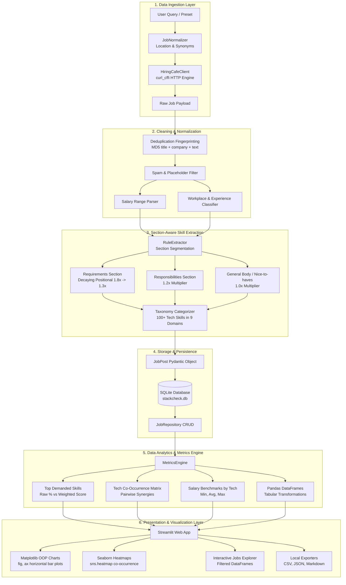

# StackCheck: System Architecture and Technical Specification

> System architecture, data pipeline, and technical specification for StackCheck.

---

## 1. Repository structure

```
StackCheck/
├── app.py                      # Top-level launcher: streamlit run app.py
├── build_app.py                # Standalone PyInstaller desktop binary compiler
├── pyproject.toml              # Dependencies and build configuration
├── README.md                   # Project documentation and usage guide
├── PRESENTATION.md             # Technical methodology and slide deck
├── ARCHITECTURE.md             # Complete system architecture specification
├── tests/                      # Automated unit test suite
│   ├── test_analyzer.py        # Tests for segmentation, weighting, and metrics
│   ├── test_client.py          # Tests for client parsing and location normalizer
│   ├── test_normalizer_relevance.py # Tests for role relevance filtering
│   ├── test_salary_chart_robustness.py # Tests for sample size thresholds and chart layout
│   ├── test_storage.py         # Tests for SQLite repository, projects, and isolation
│   ├── test_web.py             # Tests for Pandas conversions and Matplotlib charts
│   ├── test_cli.py             # Tests for Rich CLI commands, flags, and outputs
│   └── test_launcher.py        # Tests for instance tracking, script sync, and environment handling
└── src/stackcheck/
    ├── client/                 # Data ingestion layer
    │   ├── hiringcafe.py       # Live scraper (curl_cffi)
    │   └── normalizer.py       # Country synonym mapper and data cleaner
    ├── analyzer/               # Section-aware data analysis engine
    │   ├── taxonomy.py         # 100+ technologies across 9 domain categories
    │   ├── rule_extractor.py   # Requirements (1.8x) vs responsibilities (1.2x)
    │   ├── llm_extractor.py    # Optional Gemini or OpenAI enrichment
    │   ├── currency.py         # Currency normalizer and daily exchange rate sync
    │   └── metrics.py          # Co-occurrence, salary statistics, and Pandas DataFrames
    ├── storage/                # Storage and export layer
    │   ├── db.py               # SQLite schema (projects, search runs, jobs, skills)
    │   ├── repository.py       # Project-scoped data access layer
    │   ├── sync.py             # Community benchmark aggregator
    │   └── exporters.py        # CSV, JSON, and Markdown report exporters
    ├── web/                    # Streamlit web dashboard layer
    │   ├── app.py              # Interactive web analytics dashboard
    │   └── charts.py           # Matplotlib object-oriented API and Seaborn heatmaps
    ├── models.py               # Pydantic data schemas
    ├── config.py               # Central workspace paths (~/.stackcheck/)
    ├── launcher.py             # Programmatic Streamlit bootloader and lifecycle engine
    ├── updater.py              # In-place auto-updater from GitHub Releases
    └── cli.py                  # Rich CLI interface
```

---

## 2. End-to-end data pipeline architecture



---

## 3. Core architectural subsystems

### Layer 1: Data ingestion and normalization (`src/stackcheck/client/`)
- **`hiringcafe.py` (`HiringCafeClient`)**:
  - Connects to HiringCafe public search API using `curl_cffi` (`impersonate="chrome124"`) to navigate TLS handshakes and emulate standard browser behavior.
  - **Batch retrieval:** Intercepts Next.js `__NEXT_DATA__` server-rendered payloads. Each HTTP request returns 60 to 90 complete structured job records. Collecting 2,000 jobs requires roughly 25 to 30 requests in total.
  - **Polite request pacing:** Sequential requests pause briefly (`time.sleep(0.35)`) over a persistent HTTP connection to maintain steady pacing.
  - **Local execution:** Ingested jobs store in local SQLite. Subsequent skill parsing, salary calculations, filtering, and chart generation happen entirely on the local machine without recurring network calls.
  - **Live data policy:** Collects actual job postings. If network errors occur, reports status messages directly rather than fabricating data.
- **`normalizer.py` (`JobNormalizer`)**:
  - **Role relevance filtering (`is_role_relevant`)**: Tokenized title validator preventing unrelated roles from polluting specific searches.
  - **Location mapping**: Maps abbreviations and common misspellings to canonical country names.
  - **Deduplication fingerprinting**: Calculates `MD5(normalized_title | normalized_company | first_200_desc_chars)` to remove duplicates across scrape runs.
  - **Spam filtering**: Drops commission-only schemes and descriptions shorter than 30 characters.
  - **Salary extraction**: Parses structured compensation ranges or extracts yearly and hourly compensation via regex.

---

### Layer 2: Analysis and metrics engine (`src/stackcheck/analyzer/`)
- **`taxonomy.py`**:
  - Contains 100+ normalized technologies grouped into 9 standardized categories:
    1. *Programming Languages* (Python, SQL, R, Java, TypeScript, Go)
    2. *BI and Visualization* (Power BI, Tableau, Looker, Metabase)
    3. *Data Engineering and Platforms* (Spark, dbt, Airflow, Kafka, Databricks, Snowflake)
    4. *Databases and Storage* (PostgreSQL, MySQL, MongoDB, Redis)
    5. *Cloud and DevOps* (AWS, GCP, Azure, Docker, Kubernetes, Terraform)
    6. *AI / ML and Analytics* (PyTorch, TensorFlow, Scikit-learn, LangChain, LLMs)
    7. *Frameworks and Libraries* (FastAPI, React, Next.js, Django)
    8. *Concepts and Methodologies* (Data Modeling, ETL/ELT, A/B Testing, Statistics, Agile)
    9. *Other Tools*
- **`rule_extractor.py` (`RuleExtractor`)**:
  - Analyzes job description structure. Prioritizes candidate requirement sections over general company overviews.
  - **Positional multipliers**:
    $$\text{Bullet 1} = 1.8\times \quad\mid\quad \text{Bullet 2} = 1.5\times \quad\mid\quad \text{Bullet 3} = 1.3\times \quad\mid\quad \text{Responsibilities} = 1.2\times \quad\mid\quad \text{Body} = 1.0\times$$
- **`llm_extractor.py` (`LLMExtractor`)**:
  - Optional zero-shot extractor supporting Google Gemini (`gemini-1.5-flash`) and OpenAI (`gpt-4o-mini`).
- **`metrics.py` (`MetricsEngine`)**:
  - Aggregates market metrics:
    - Overall skill frequency and weighted demand score.
    - Pairwise co-occurrence matrix for tech combinations.
    - Salary percentiles (Min, Average, Max) segmented by technology.
    - Regional partitions (United States, Europe, Pakistan, India, APAC, Latin America, Middle East, Remote).
    - Converts structured models to Pandas DataFrames.
- **`currency.py` (`CurrencyManager`)**:
  - **Exchange rate engine**: Reads floating exchange rates against USD with a 24-hour cache.
  - **Offline baseline fallbacks**: Bundles offline fallback rates for major currencies (INR, PKR, PHP, EUR, GBP, CAD, AUD, CRC, SGD).
  - **Cache persistence**: Stores daily rates in `~/.stackcheck/exchange_rates.json`.
  - **Currency inference**: Recognizes when foreign postings have compensation mislabeled with dollar signs and converts to annual USD benchmarks.
  - **Statistical bounds**: Applies bounds ($5,000 to $750,000 USD annual) to keep extreme outliers from distorting averages.

---

### Layer 3: Persistence and exporters (`src/stackcheck/storage/`)
- **`db.py` (`DatabaseManager`)**:
  - Embedded SQLite database located at `~/.stackcheck/stackcheck.db`.
  - Context manager connections prevent open file handle leaks.
  - Multi-project isolation through foreign keys (`project_id`).
- **`repository.py` (`JobRepository`)**:
  - Data access layer providing save, query, project CRUD, search run logging, and cached job retrieval.
- **`sync.py` (`CommunitySyncClient`)**:
  - Local aggregation engine tracking real data distributions.
- **`exporters.py` (`ReportExporter`)**:
  - Generates:
    - `JSON` full schema dump (`exports/stackcheck_run_*.json`).
    - `CSV` flat dataset with extracted skill strings (`exports/stackcheck_jobs_*.csv`).
    - `Markdown` summary (`exports/stackcheck_report_*.md`).

---

### Layer 4: Interactive web dashboard and charts (`src/stackcheck/web/`)
- **`charts.py`**:
  - Built using Matplotlib object-oriented API (`fig, ax = plt.subplots(...)`) and Seaborn:
    - **`plot_top_skills()`**: Horizontal bar chart with percentage labels and clean spines.
    - **`plot_co_occurrence_heatmap()`**: Correlation matrix heatmap (`sns.heatmap`) with annotated frequencies.
    - **`plot_salary_by_tech()`**: Grouped salary error-bar chart showing minimum, average, and maximum compensation with sample-size thresholds (`min_samples >= 3`).
    - **`plot_distributions()`**: Donut charts for workplace mode and bar plots for experience level.
    - **`plot_category_breakdown()`**: Domain comparison bar chart.
- **`app.py`**:
  - 4-tab Streamlit dashboard:
    1. **Executive Market Dashboard**: Summary cards, top skills chart with weighted score toggle, category breakdown, and project switcher.
    2. **Statistical Analytics**: Co-occurrence heatmap, salary error bars, workplace and experience distributions, regional table.
    3. **Job Explorer**: Filterable table with text filter, skill dropdown, and expandable post details.
    4. **Data Export**: File download options for JSON, CSV, and Markdown.

---

### Layer 5: Desktop launcher and workspace engine (`src/stackcheck/launcher.py`, `cli.py`, `updater.py`)
- **`launcher.py`**:
  - Boots local Streamlit engine programmatically without requiring system Streamlit in PATH.
  - **Single-instance check**: Verifies active PID from `~/.stackcheck/stackcheck.pid` and port availability. If an instance is active, focuses the existing browser tab instead of starting duplicate processes.
  - **Readiness check**: Checks TCP connection availability before opening the browser.
  - **Static asset cache**: Mirrors Streamlit static assets to `~/.stackcheck/streamlit_static/` to keep bundled distributions reliable.
  - **Console encoding**: Configures standard streams on Windows consoles to prevent encoding errors with Unicode checkmarks and tables.
- **`cli.py`**:
  - Click CLI styled with Rich tables and panels.
  - Commands: `stackcheck`, `stackcheck check`, `stackcheck status`, `stackcheck stop`, `stackcheck update`, `stackcheck search`, `stackcheck analyze`, `stackcheck export`, `stackcheck projects`, and `stackcheck sync`.
- **`updater.py`**:
  - In-place updater querying GitHub Releases API.
  - Detects system architecture, downloads updates with progress indicators, and applies executable permissions.

---

## 4. SQLite database schema and workspace storage

### Central workspace layout (`~/.stackcheck/`)
- `~/.stackcheck/stackcheck.db`: Central SQLite database.
- `~/.stackcheck/stackcheck.pid`: Active server process PID.
- `~/.stackcheck/stackcheck.json`: Port, URL, and start timestamp metadata.
- `~/.stackcheck/stackcheck.log`: Background process log file.
- `~/.stackcheck/streamlit_static/`: Streamlit frontend assets cache.
- `~/.stackcheck/web/`: Synchronized application files (`app.py`, `charts.py`).
- `~/.stackcheck/assets/`: Brand icons and logos.
- `~/.stackcheck/exports/`: Exported JSON, CSV, and Markdown files.

### Relational schema diagram
```
┌─────────────────────────────────┐
│            projects             │
├─────────────────────────────────┤
│ id           TEXT PRIMARY KEY   │
│ name         TEXT NOT NULL      │
│ description  TEXT               │
│ created_at   DATETIME           │
└─────────────────────────────────┘
          │ 1               │ 1
          │                 │
          │ *               │ *
┌─────────────────────────────────┐       ┌─────────────────────────────────┐
│          search_runs            │       │              jobs               │
├─────────────────────────────────┼───────┼─────────────────────────────────┤
│ id           INTEGER PK AUTOINC │ 1   * │ id           TEXT PRIMARY KEY   │
│ project_id   TEXT FK            │───────│ project_id   TEXT FK            │
│ query_str    TEXT NOT NULL      │       │ search_run_id INTEGER FK        │
│ location     TEXT               │       │ title        TEXT NOT NULL      │
│ workplace    TEXT               │       │ company      TEXT NOT NULL      │
│ experience   TEXT               │       │ location     TEXT               │
│ total_jobs   INTEGER            │       │ country      TEXT               │
│ created_at   DATETIME           │       │ region       TEXT               │
└─────────────────────────────────┘       │ workplace    TEXT               │
                                          │ experience   TEXT               │
                                          │ salary_min   REAL               │
                                          │ salary_max   REAL               │
                                          │ salary_curr  TEXT               │
                                          │ salary_period TEXT              │
                                          │ apply_url    TEXT               │
                                          │ scraped_at   DATETIME           │
                                          └─────────────────────────────────┘
                                                           │ 1
                                                           │
                                                           │ *
                                          ┌─────────────────────────────────┐
                                          │        extracted_skills         │
                                          ├─────────────────────────────────┤
                                          │ id           INTEGER PK AUTOINC │
                                          │ job_id       TEXT NOT NULL FK   │
                                          │ name         TEXT NOT NULL      │
                                          │ canonical    TEXT NOT NULL      │
                                          │ category     TEXT NOT NULL      │
                                          │ source_sec   TEXT               │
                                          │ priority_wt  REAL               │
                                          └─────────────────────────────────┘
```

---

## 5. Analyst skills demonstrated

| Competency | Implementation details |
| :--- | :--- |
| Matplotlib object-oriented API (`fig, ax`) | Explicit figure and axes creation, custom axis limits, direct text bar labels (`ax.text`), and tick formatters. |
| Seaborn statistical charts | Symmetrical co-occurrence correlation matrix heatmaps (`sns.heatmap`) and `sns.despine` styling. |
| Pandas data pipelines | DataFrame conversions, vector filtering, co-occurrence frequency counts, group aggregations, and CSV serialization. |
| Data cleaning and normalization | String matching, synonym mapping for global tech hubs, regex compensation parsing, and MD5 duplicate elimination. |

---

## 6. Test suite and verification

The automated test suite contains 36 unit tests validating data ingestion, parsing, weighting, SQLite operations, multi-project isolation, DataFrame conversions, Matplotlib chart rendering, CLI commands, and launcher lifecycle management:

```bash
pytest tests/ -v
```

---

## 7. Execution and distribution

### 1. Development mode
```bash
# Run the interactive dashboard via local Python environment
stackcheck

# Direct Streamlit launch
streamlit run app.py
```

### 2. Standalone desktop binary
```bash
# Compile standalone desktop executable
python build_app.py --onefile

# Run compiled binary directly
./dist/StackCheck

# Check service health and uptime
./dist/StackCheck status

# Run dependency verification
./dist/StackCheck check

# Terminate running server
./dist/StackCheck stop
```
